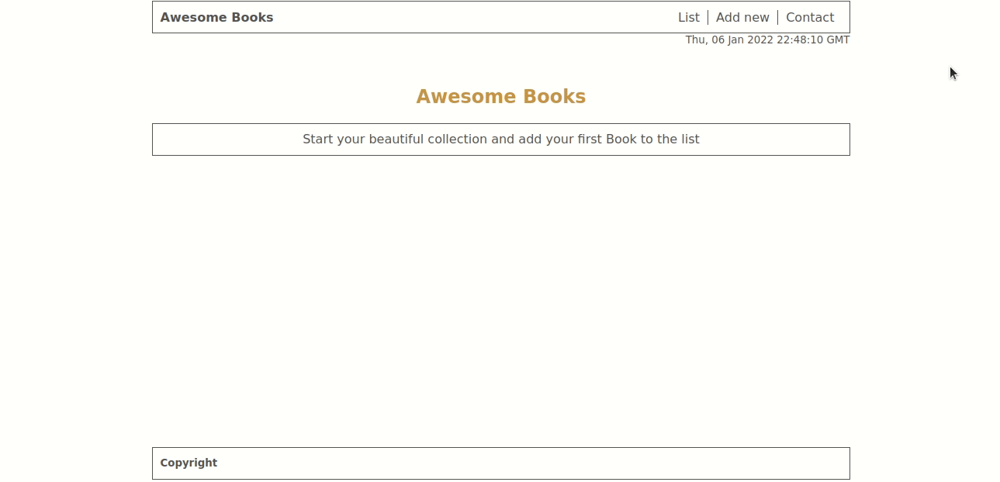

# Awesome Books

> A web app to store books.

The app allows you to add, store and remove books.

## Below is a GIF showing the app

## Live Demo

You can see [the app live here](https://sahar-abdelsamad.github.io/Awesome-Books/)

## Built With

- HTML, CSS, JavaScript.

## Getting Started

To get a local copy up and running follow these simple example steps.

### Setup

 Clone the repository https://github.com/Sahar-AbdelSamad/Awesome-Books-Modules using `git clone`
 
 Run `npm install`

👤 **Sahar Abdel Samad**

- GitHub: [@sahar-abdelsamad](https://github.com/Sahar-AbdelSamad)
- Twitter: [@abdelsamadsahar](https://twitter.com/AbdelSamadSahar)
- LinkedIn: [abdel-samad-sahar](https://www.linkedin.com/in/abdel-samad-sahar-353977223/)

👤 **Mar Bautista**

- GitHub: [@marilirulita](https://github.com/marilirulita)
- Twitter: [@marilirulita](https://twitter.com/marylirulita)
- LinkedIn: [@marilirulita](https://www.linkedin.com/in/mar-y-sol-bautista-5a6894151/)

## 🤝 Contributing

Contributions, issues, and feature requests are welcome!

Feel free to check the [issues page](https://github.com/Sahar-AbdelSamad/Awesome-Books/issues).

## Show your support

Give a ⭐️ if you like this project!
